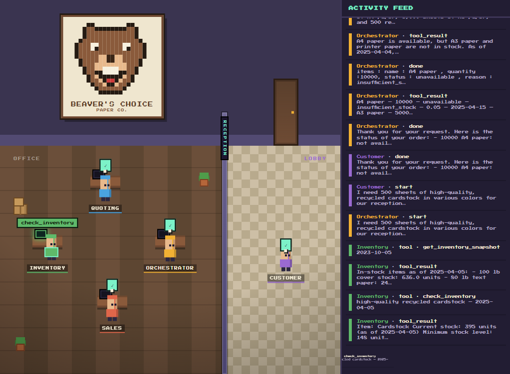

# Beaver's Choice Multi-Agent System Project

Welcome to the starter code repository for the **Beaver's Choice Paper Company Multi-Agent System Project**! This repository contains the starter code and tools you will need to design, build, and test a multi-agent system that supports core business operations at a fictional paper manufacturing company.

## Project Context

You’ve been hired as an AI consultant by Beaver's Choice Paper Company, a fictional enterprise looking to modernize their workflows. They need a smart, modular **multi-agent system** to automate:

- **Inventory checks** and restocking decisions
- **Quote generation** for incoming sales inquiries
- **Order fulfillment** including supplier logistics and transactions

Your solution must use a maximum of **5 agents** and process inputs and outputs entirely via **text-based communication**.

This project challenges your ability to orchestrate agents using modern Python frameworks like `smolagents`, `pydantic-ai`, or `npcsh`, and combine that with real data tools like `sqlite3`, `pandas`, and LLM prompt engineering.

---

## What’s Included

From the `project.zip` starter archive, you will find:

- `project_solution.py`: The main Python script you will modify to implement your agent system
- `quotes.csv`: Historical quote data used for reference by quoting agents
- `quote_requests.csv`: Incoming customer requests used to build quoting logic
- `quote_requests_sample.csv`: A set of simulated test cases to evaluate your system

---

## Workspace Instructions

All the files have been provided in the VS Code workspace on the Udacity platform. Please install the agent orchestration framework of your choice.

## Local setup instructions

1. Install dependencies

Make sure you have Python 3.8+ installed.

You can install all required packages using the provided requirements.txt file:

`pip install -r requirements.txt`

If you're using smolagents, install it separately:

`pip install smolagents`

For other options like pydantic-ai or npcsh[lite], refer to their documentation.

2. Create .env File

Add your OpenAI-compatible API key:

`UDACITY_OPENAI_API_KEY=your_openai_key_here`

This project uses a custom OpenAI-compatible proxy hosted at https://openai.vocareum.com/v1.

## How to Run the Project

Start by defining your agents in the `"YOUR MULTI AGENT STARTS HERE"` section inside `project_solution.py`. Once your agent team is ready:

1. Run the `run_test_scenarios()` function at the bottom of the script (e.g. `python project_solution.py`).
2. This will simulate a series of customer requests.
3. Your system should respond by coordinating inventory checks, generating quotes, and processing orders.

Output will include:

- Agent responses
- Cash and inventory updates
- Final financial report
- A `test_results.csv` file with all interaction logs

> The SQLite database `beavers_choice.db` is **created automatically** at the start of each
> run (rebuilt from `quote_requests.csv`, `quotes.csv`, and the in-code inventory seed), so
> it is not tracked in the repository — you do not need to provide or download it.

---

## Stand-out Work (for the project reviewer)

Beyond the graded `project_solution.py`, this repository includes three optional stand-out
features. **None of them are required to run or grade the project** — `project_solution.py`
is fully self-contained (its transcript hook is wrapped in `try/except` and gated by an
env flag, so the system runs and produces `test_results.csv` even if the files below are
absent). The extras are kept in their own files so the graded path stays untouched:

| File | What it adds |
|------|--------------|
| `agent_transcript.py` | A `smolagents` step-callback observer that records each agent state change to `transcript.jsonl`. |
| `viewer/` | A zero-dependency, stdlib-only **pixel-art office** that animates the run in the browser. |
| `customer_negotiation_demo.py` | An LLM-driven **customer agent** that negotiates (up to 3 rounds) with the real company team. |
| `workflow_diagram.mmd` / `workflow_diagram.png` | A Mermaid architecture diagram of the agents and their tools. |



*The pixel-art office: each desk is one agent (orchestrator, inventory, quoting, sales), the
customer waits in the lobby, and the activity feed on the right tails the run in real time.*

### How to see the pixel-art animation

The viewer animates a `transcript.jsonl` file. That file is **gitignored**, so a fresh
clone won't have one yet — you must run the system at least once to generate it.

**Option A — watch a finished run (REPLAY, simplest):**

1. Generate a transcript by running the graded system once:
   ```
   python project_solution.py
   ```
   This writes `transcript.jsonl` to the repo root (logging is on by default; disable with
   `AGENT_TRANSCRIPT_LOG=0`).
2. Start the viewer:
   ```
   python viewer/server.py
   ```
3. Open `http://127.0.0.1:8000/` (or VS Code's Simple Browser) and click **REPLAY** to play
   the run back at adjustable speed.

**Option B — watch it happen live (LIVE):**

1. In terminal 1, start the viewer: `python viewer/server.py`
2. Open `http://127.0.0.1:8000/` and click **LIVE**.
3. In terminal 2, run the system: `python project_solution.py`
4. The office animates each agent (orchestrator, inventory, quoting, sales, customer) as it
   thinks, calls tools, and finishes. The right-hand **activity feed** lists each event,
   color-coded per agent.

### How to see the customer-negotiation demo

For a richer animation that includes a haggling customer, run the negotiation demo instead
of (or alongside) the steps above:

```
python customer_negotiation_demo.py
```

It drives the *real* company team through up to three negotiation rounds per persona and
writes to the same `transcript.jsonl`, so the viewer (LIVE or REPLAY) shows the full
back-and-forth. This demo only affects itself — it never changes the graded
`run_test_scenarios()` path.

> Both `project_solution.py` and `customer_negotiation_demo.py` need a valid
> `UDACITY_OPENAI_API_KEY` in your `.env` (see **Local setup instructions** above).

---

## Tips for Success

- Start by sketching a **flow diagram** to visualize agent responsibilities and interactions.
- Test individual agent tools before full orchestration.
- Always include **dates** in customer requests when passing data between agents.
- Ensure every quote includes **bulk discounts** and uses past data when available.
- Use the **exact item names** from the database to avoid transaction failures.

---

## Submission Checklist

Make sure to submit the following files:

1. Your completed `project_solution.py` with all agent logic
2. A **workflow diagram** describing your agent architecture and data flow (`workflow_diagram.png` / `workflow_diagram.mmd`)
3. A design/reflection write-up explaining how your system works (`reflection_report.md`, plus this `README.md`)
4. Outputs from your test run (like `test_results.csv`)

Optional stand-out files: `agent_transcript.py`, the `viewer/` pixel-office, and `customer_negotiation_demo.py` (see **Stand-out Work** above).

---